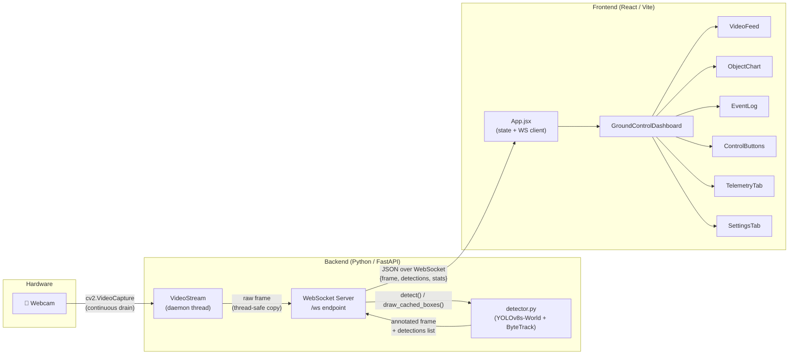
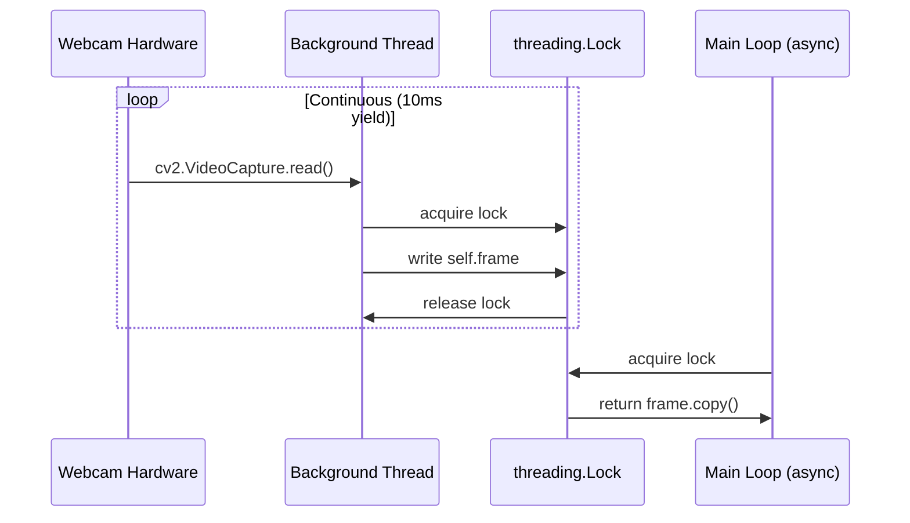
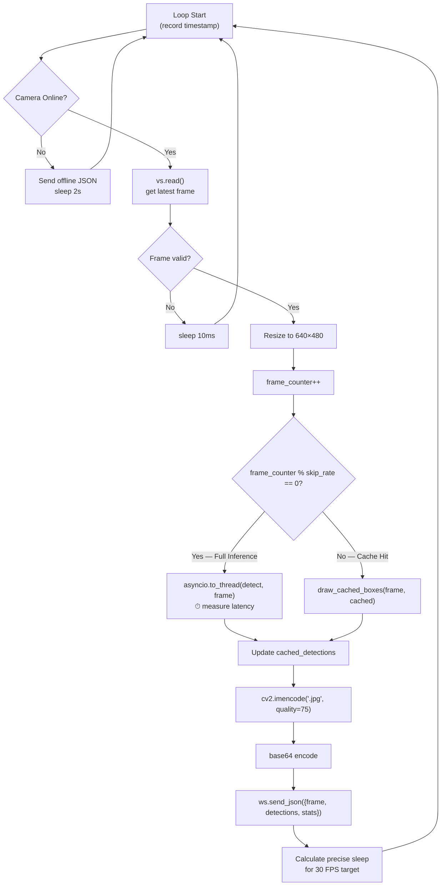
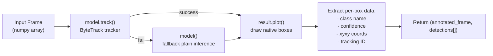
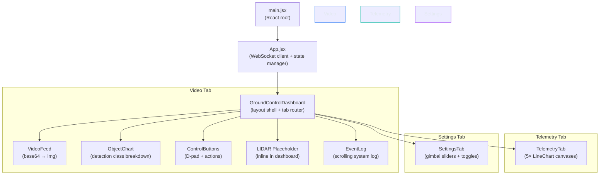

# Robotic Platform — Architecture & Processing Workflow

## High-Level System Topology



---

## Backend Architecture

The backend lives in [backend/](file:///c:/Robotic-platform/backend) and is composed of two core modules plus the YOLO model weights.

### 1. FastAPI Application — [main.py](file:///c:/Robotic-platform/backend/main.py)

This is the server entrypoint, started with `uvicorn main:app --reload`.

#### Key Components

| Component | Lines | Purpose |
|---|---|---|
| [VideoStream](file:///c:/Robotic-platform/backend/main.py#L22-L72) | 22–72 | Threaded camera reader that continuously drains the hardware buffer on a daemon thread |
| [read_root](file:///c:/Robotic-platform/backend/main.py#L74-L81) | 74–81 | `GET /` health-check endpoint returning status, device, and model info |
| [websocket_endpoint](file:///c:/Robotic-platform/backend/main.py#L83-L170) | 83–170 | `WS /ws` — the main real-time streaming loop |

#### VideoStream (Threaded Camera Reader)



> [!TIP]
> The `VideoStream` class solves a critical latency problem: OpenCV's `VideoCapture.read()` blocks on the OS camera buffer. If you only read when you need a frame, you get stale buffered frames (adding 100-300ms of delay). By continuously draining the buffer on a background thread with a 10ms yield, the main loop always gets the **latest** frame.

#### WebSocket Streaming Loop

The core processing loop inside [websocket_endpoint](file:///c:/Robotic-platform/backend/main.py#L104-L164) follows this cycle for every frame:



> [!IMPORTANT]
> **Inference Skip Rate** is the central performance lever:
> - **GPU (CUDA)**: skip rate = `0.5` → infers on **every** frame (since `frame_counter % 0.5` is always 0 in Python)
> - **CPU**: skip rate = `3` → infers on **1 out of 3** frames, drawing cached boxes on the other 2
>
> This reduces model compute by **66%** on CPU while maintaining smooth 30 FPS visual output.

---

### 2. Object Detection Engine — [detector.py](file:///c:/Robotic-platform/backend/detector.py)

#### Model Initialization ([L1-L98](file:///c:/Robotic-platform/backend/detector.py#L1-L98))

- **Model**: `YOLOv8s-World` (27 MB weights file) — an open-vocabulary detection model
- **Device Selection**: Auto-detects CUDA GPU, falls back to CPU
- **Custom Class Set**: 60+ classes configured via `model.set_classes(...)`, covering:
  - People (person, hand, arm, face, head)
  - Electronics (laptop, monitor, phone, keyboard, etc.)
  - Furniture (chair, desk, bookshelf, etc.)
  - Robotics (drone, robot, motor, sensor, etc.)
  - Office items, personal items, stationery

#### Detection Function — [detect()](file:///c:/Robotic-platform/backend/detector.py#L100-L158)



Each detection in the returned list has this structure:
```json
{
    "id": 3,
    "class": "person",
    "confidence": 0.94,
    "box": [120, 45, 380, 460]
}
```

#### Cached Box Renderer — [draw_cached_boxes()](file:///c:/Robotic-platform/backend/detector.py#L167-L220)

For frames that skip inference, this function re-draws the **previous** detection boxes onto the **fresh** frame using OpenCV primitives (rectangles + text labels). This is extremely fast (<0.1ms) and maintains visual continuity.

---

### 3. Supporting Files

| File | Purpose |
|---|---|
| [download.py](file:///c:/Robotic-platform/backend/download.py) | Dataset download utility for Objects365 training data (not used at runtime) |
| [test.py](file:///c:/Robotic-platform/backend/test.py) | Standalone CLI test script — opens webcam, runs `detect()`, shows in OpenCV window |
| `yolov8n.pt` (6.5 MB) | YOLOv8-nano weights (available but **not currently loaded**) |
| `yolov8s-world.pt` (27 MB) | YOLOv8s-World weights (**active model**) |

---

## Frontend Architecture

The frontend lives in [frontend/](file:///c:/Robotic-platform/frontend) and is a **React 19 + Vite 8** single-page application.

### Component Hierarchy



### Component Breakdown

#### [App.jsx](file:///c:/Robotic-platform/frontend/src/App.jsx) — Central State Manager

This is the **brain** of the frontend. It manages:

| State | Type | Source |
|---|---|---|
| `frame` | `string \| null` | Base64 JPEG from WebSocket |
| `detections` | `array` | Parsed detection objects from WebSocket |
| `stats` | `object` | Merged backend stats + locally computed FPS |
| `events` | `array` | System event log (last 50 entries) |
| `theme` | `'dark' \| 'light'` | Persisted in `localStorage` |

**WebSocket lifecycle** (lines [39–121](file:///c:/Robotic-platform/frontend/src/App.jsx#L39-L121)):
1. Connect to `ws://localhost:8000/ws`
2. On each message: parse JSON, compute local FPS from frame arrival deltas, update all state
3. On close: auto-reconnect after 3 seconds
4. **Smart event generation**: Compares current detected classes against previous frame's classes to generate "Acquired tracking" and "Lost tracking" events

#### [GroundControlDashboard](file:///c:/Robotic-platform/frontend/src/components/groundcontrol/GroundControlDashboard.jsx) — Layout & Tab Router

- **Header**: Logo with pulse animation, system status indicator, theme toggle (TACTICAL/ENTERPRISE), tab navigation
- **3 Tabs**: Video (default), Telemetry, Settings
- **Video Tab Layout**: Two-column grid — left column has video feed + chart/controls, right column has LIDAR map + event log

#### [VideoFeed](file:///c:/Robotic-platform/frontend/src/components/VideoFeed.jsx) — Live Video Display

- Renders the base64 frame as an `` tag with `data:image/jpeg;base64,...` src
- When offline, shows a theme-aware SVG placeholder with a grid + crosshair pattern
- HUD overlay pills show connection status and operating mode

#### [ObjectChart](file:///c:/Robotic-platform/frontend/src/components/ObjectChart.jsx) — Detection Breakdown

- Aggregates detections by class name
- Renders horizontal bar chart showing relative count of each class

#### [EventLog](file:///c:/Robotic-platform/frontend/src/components/EventLog.jsx) — System Log

- Scrollable list of timestamped events with color-coded type badges (System, Detected, Warning, Error)

#### [ControlButtons](file:///c:/Robotic-platform/frontend/src/components/ControlButtons.jsx) — Robot Controls

- **Action buttons**: Start, Stop, Snapshot
- **Navigation D-pad**: Forward/Back/Left/Right with keyboard arrow key support
- **Emergency Stop**: Prominent red button
- Currently logs to console — designed as a stub for future backend integration

#### [TelemetryTab](file:///c:/Robotic-platform/frontend/src/components/TelemetryTab.jsx) — Sensor Telemetry

- **5 real-time line charts** rendered on `<canvas>` elements:
  - Core Temperature (°C), Pressure (kPa), Orientation X/Y/Z (°)
- Each chart shows: live plot line with area fill, data dots, and a stats readout (Current / Min / Max / Avg / Status)
- Data is **simulated** with random walk (updated every 1.5s) — ready to be wired to real sensor data
- Supports health status thresholds (OK / WARNING / CRITICAL)

#### [SettingsTab](file:///c:/Robotic-platform/frontend/src/components/SettingsTab.jsx) — Configuration

- Camera gimbal control (Tilt: ±90°, Pan: ±180° sliders)
- Sensor recalibration button
- Telemetry stream toggle

#### Other Components (available but not actively used in main layout)

| Component | File | Purpose |
|---|---|---|
| [StatsPanel](file:///c:/Robotic-platform/frontend/src/components/StatsPanel.jsx) | Stats readout panel (FPS, latency, objects, mode) |
| [LidarMap](file:///c:/Robotic-platform/frontend/src/components/LidarMap.jsx) | Animated 2D radar sweep simulation with moving targets |
| [DetectionTable](file:///c:/Robotic-platform/frontend/src/components/DetectionTable.jsx) | Tabular view of detection IDs, classes, and confidence |

> [!NOTE]
> `LidarMap` has a full canvas-based radar animation with sweep beam, glowing target particles, and HUD overlays — but the dashboard currently uses an inline LIDAR placeholder instead. `StatsPanel` and `DetectionTable` are also defined but not imported into the active layout.

---

## End-to-End Data Flow

Here is the complete journey of a single video frame from physical photons to pixels on screen:

```mermaid
sequenceDiagram
    participant Cam as 🎥 Webcam
    participant BG as Background Thread
    participant Loop as FastAPI WS Loop
    participant YOLO as YOLOv8 + ByteTrack
    participant WS as WebSocket
    participant App as React App.jsx
    participant DOM as Browser DOM

    Note over Cam,BG: Phase 1: Capture (daemon thread)
    Cam->>BG: Hardware frame buffer
    BG->>BG: cv2.read() → store latest frame
    BG->>BG: sleep(10ms), repeat

    Note over Loop,YOLO: Phase 2: Process (async event loop)
    Loop->>BG: vs.read() → thread-safe copy
    BG-->>Loop: raw_frame (640×480)

    alt Every Nth frame (inference)
        Loop->>YOLO: asyncio.to_thread(detect, frame)
        YOLO->>YOLO: model.track(ByteTrack)
        YOLO->>YOLO: result.plot() + extract boxes
        YOLO-->>Loop: annotated_frame + detections[]
        Loop->>Loop: Cache detections
    else Other frames (cached)
        Loop->>Loop: draw_cached_boxes(frame, cached)
    end

    Note over Loop,WS: Phase 3: Encode & Transmit
    Loop->>Loop: cv2.imencode('.jpg', quality=75)
    Loop->>Loop: base64.b64encode()
    Loop->>WS: send_json({frame, detections, stats})

    Note over App,DOM: Phase 4: Render (browser)
    WS->>App: onmessage event
    App->>App: JSON.parse → compute FPS
    App->>App: Compare classes → generate events
    App->>App: setState(frame, detections, stats, events)
    App->>DOM: React re-render
    DOM->>DOM: 
```

---

## Performance Optimizations Summary

| Optimization | Where | Impact |
|---|---|---|
| **Threaded camera drain** | [VideoStream](file:///c:/Robotic-platform/backend/main.py#L22-L72) | Eliminates 100-300ms buffer delay |
| **Inference skip (1-of-3)** | [WS loop L98-L101](file:///c:/Robotic-platform/backend/main.py#L98-L101) | 66% reduction in model compute on CPU |
| **Cached box rendering** | [draw_cached_boxes](file:///c:/Robotic-platform/backend/detector.py#L167-L220) | <0.1ms per frame vs ~30ms for inference |
| **asyncio.to_thread()** | [WS loop L139](file:///c:/Robotic-platform/backend/main.py#L139) | Offloads blocking YOLO to thread pool, keeps event loop responsive |
| **JPEG quality 75** | [WS loop L147](file:///c:/Robotic-platform/backend/main.py#L147) | ~60% smaller base64 payloads |
| **640×480 standardization** | [WS loop L130-L131](file:///c:/Robotic-platform/backend/main.py#L130-L131) | Consistent network payload size regardless of camera resolution |
| **30 FPS sleep targeting** | [WS loop L162-L164](file:///c:/Robotic-platform/backend/main.py#L162-L164) | Precise frame pacing accounting for processing time |
| **Event log cap (50)** | [App.jsx L36](file:///c:/Robotic-platform/frontend/src/App.jsx#L36) | Prevents unbounded memory growth |
| **Class diff for events** | [App.jsx L75-L86](file:///c:/Robotic-platform/frontend/src/App.jsx#L75-L86) | Only generates events on detection changes, not every frame |

---

## Technology Stack

| Layer | Technology | Version |
|---|---|---|
| **Server Framework** | FastAPI + Uvicorn | Latest |
| **Computer Vision** | OpenCV (cv2) | Latest |
| **Object Detection** | Ultralytics YOLOv8s-World | Latest |
| **Object Tracking** | ByteTrack | Built into Ultralytics |
| **GPU Acceleration** | PyTorch + CUDA (optional) | Auto-detected |
| **Transport** | WebSocket (native) | RFC 6455 |
| **Frontend Framework** | React | 19.2.6 |
| **Build Tool** | Vite | 8.0.12 |
| **Language** | Python (backend), JavaScript/JSX (frontend) | 3.8+ / ES2020+ |
